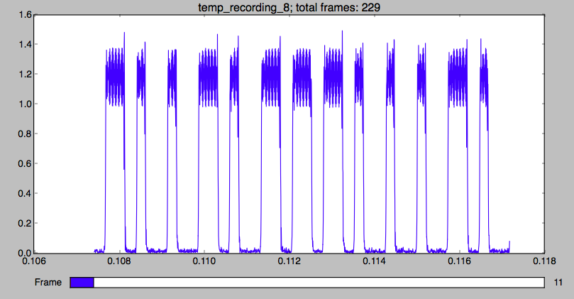
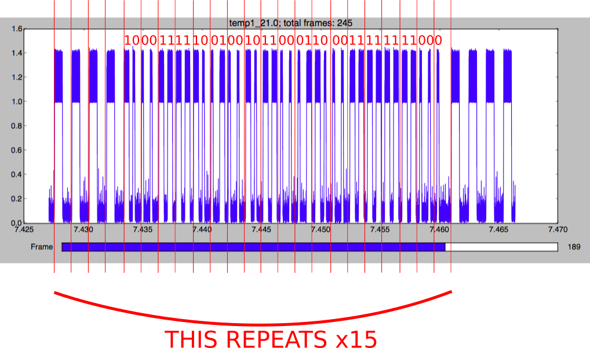
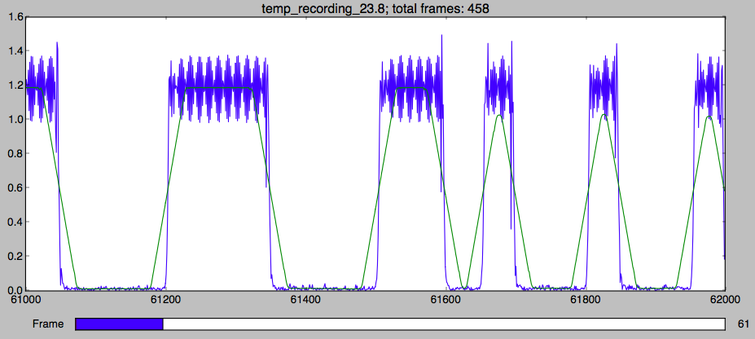
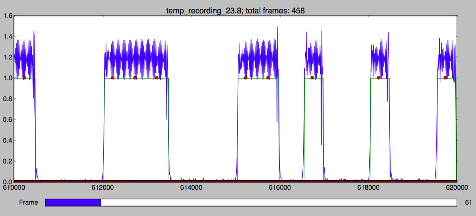

# radio-temperature

Read radio temperature data from Lacrosse TX29 (?) transmitter using RTL-SDR

To Run: `python decode_stdin.py [sample_rate] [decimation] [baud_rate] < rtl_sdr -f [center_freq_hz] -g [gain] -s [sample_rate]`

Example: `python decode_stdin.py 2048000 10 4096 < rtl_sdr -f 433920000 -g 40 -s 2048000`

Test: `python decode_stdin.py 2048000 10 4096 < temp_recording_23.8` # should output a temperature of 23.8

Only requires a few numpy functions, namely `decimate` and `convolve`.

I did this project for fun and to learn a bit how signal processing works.  I don't really know what I'm talking about, but for those looking to learn, I can share a few details.

I use strings just for convenience; they're easy to print, search, slice, etc.  A pure C implementation using buffers and bitwise operations would probably be better.  But I didn't really care.  This should also make it easy to work with if you want to edit any code here.

## Requirements/Installation

  * An rtl-sdr dongle, kinda like this: https://www.amazon.ca/digital-Stick-RTL-SDR-Receiver-RTL2832U/dp/B00CM3LNMM
  * python
  * Install rtl-sdr libraries
    * Mac: `brew install gr-osmosdr librtlsdr rtlsdr`
    * Win: http://sdr.osmocom.org/trac/wiki/rtl-sdr
  * numpy & scipy: `pip install numpy scipy`

You should now be able to run the `rtl_sdr` program from the command line. Normally, you just need to pass 3 parameters: the center frequency, the gain and the sample rate.  This will not output anything meaningful, you need to pipe the output to another program to do something useful.

You can test everything by doing: `rtl_test`

You can also listen to the radio using: `rtl_fm -f [freq in Hz] -M [fm or am]`

## Explanation

The `rtl_sdr` command line program simply outputs the raw IQ data (IQ stands for in-phase and quadrature components: https://en.wikipedia.org/wiki/In-phase_and_quadrature_components).  IQ data is basically a series of complex numbers (https://en.wikipedia.org/wiki/Complex_number) and so you can think of them as a series of vectors, they have 2 components each, the real part and the imaginary part.  This is a really great video explaining the basis of why digital radio data is represented as a stream of complex numbers: http://greatscottgadgets.com/sdr/6/.

Since the data is coming in on stdin, it's easy to capture the data in python:

```python
def get_samples(size):
	stdin = sys.stdin.read(int(size))
	data = np.frombuffer(stdin, dtype='uint8')
	samples = get_iq(data)
	return samples
```
Now you have a list of samples.  The data returned from `rtl_sdr` consists of pairs of bytes where the first byte is the real part and the second byte is the imaginary part. Then you normalize the data by dividing by `255/2` and subtracting `1+1j`. I think this has something to do about how the data comes down the pipe as unsigned integers, but this is basically copied from a python wrapper for rtlsdr (https://github.com/roger-/pyrtlsdr).

Now, I'm not too sure if the next step is so necessary, but what's happening is a kind of amplitude demodulation:

```python
def to_amplitude(iq):
	amp = np.sqrt(iq.real*iq.real+iq.imag*iq.imag)
	return amp
```

By simply doing `np.sqrt(iq.real*iq.real+iq.imag*iq.imag)` we get the *amplitude* of the radio data for each sample.

Now that we have the amplitude, we can plot this data and if you've got an actual transmission burst in your data, you'll see some square wave type pulses. You can try this using the `plot_time.py` file which basically just does `get_samples` then demodulates using `to_amplitude` and simply plots this data:

`python plot_time.py temp_recording_23.8 [decimation] [frame_size]`

There 2 other things going on in `plot_time.py` and they concern the 2 parameters `decimation` and `frame_size`. Decimating basically reduces the number of samples.  If you decimate by 10, then you'll have a factor of 10 fewer samples after decimation.  The decimation also does some filtering to account for aliasing.  We decimate because we don't need all the samples, the resolution of the transmission is too high (the file temp_recording_23.8 was recorded at 2.048 MHz which is unnecessarily high).  By decimating, we improve efficiency.  The amount of decimating you can do depends on the *Nyquist limit*, or 2 times the frequency or data/baud rate of your signal (http://photo.stackexchange.com/questions/10755/what-is-the-nyquist-limit-and-what-is-its-significance-to-photographers).

All this to say that by decimating, you make the job a lot easier because you have fewer samples and it represents the same signal anyways.

The other thing that the `plot_time.py` program is doing is breaking up the signal into frames.  Each frame will have `frame_size` number of samples in it.  This is just for viewing simplicity.  It's so that you can view the signal at a good resolution and zoom level and click through the signal in a series of frames using the slider on the bottom.

So if you run: `python plot_time.py temp_recording_23.8 10 2000` then you should get something like this:



Those teeth of varying widths represent the binary data of the signal.  A longer one is a 1 and a shorter one is a 0.

Now the task is to figure out how to extract the data.

If you fiddle with `plot_time.py`, you can eventually see that:
  * the data is being repeated 15 times
  * there is a preamble of 4 longer bursts
  * there are about 37 bits in total



After more fiddling, you'll see that after the preamble, the 14th to the 24th bits represent the temperature as `temp*10+500`. The reason the designers of this device did this was because there are no lower temperatures that -50 C and they multiply by 10 in order to have accuracy to 1 decimal place.

In the above image, you'll see the bit pattern from 14 to 24 (after the preamble) is `1011000110`. If you convert this from binary to decimal you get 710. Now subtract 500 and divide by 10 and you get 21.0 which indeed does correspond to the correct temperature for this recording.

Now that we know how the bits are in the data, we can look at how to extract them programatically.

There are a number of ways to do this, but we can do something simple.  The more serious and robust way to extract data from a signal without any clock data is using *Clock Data Recovery* (http://www.arrowdevices.com/blog/beginners-guide-to-clock-data-recovery/).  This is a rather dense subject so luckily we don't need to delve into it to solve this problem.  Because the data is *bursty*, that is, the radio signals come in bursts, we can line everything as accurately as possible and extract the data.  Overtime, our lineup would get out of wack because of jitter or clock drift.  But we're not downloading gigabytes of data so it doesn't matter.

The simple way to extract the symbols is to decimate the signal such that the spacing of each sample falls into each pulse.

We also need to smooth the data, and this is where *convolution* comes in.  This page shows pretty clearly what convolution is: https://en.wikipedia.org/wiki/Convolution.  You can think of it here as simply a moving average.

The first step is to smooth the data by convolving with a series of ones.  The size of the convolution window is important.  The way I determined the size of the window is by determining the baud rate or the number of square wave bursts per second.  These square wave bursts are also called symbols.

Note that below I actually determine there are 3 symbols per pulse, so I'm not sure I'm using the term *symbol* exactly correctly here, but basically we're just trying to get to how many pulses come per second and then how many samples are in each pulse, given our sample rate.

Looking at the temp_recording_23.8 file, I lower the `frame_size` and zoom in and roughly measure the number of samples for each of the different rectangular pulses.  Also, just to be thorough, I plotted a histogram of the widths of the rectangle pulses (using `baud.py`) and found that there were 3 different widths: 500, 1000 and 1500.

So the preamble consists of 4 pulses, each pulse contains about 1500 samples.  Then after that, the pulses are either 500 or 1000 samples long.  We want to work with the smallest samples per symbol value, because each pulse comes in a window of size 1500.  Put another way, every 1500 samples, another bit of data comes in and that data will either be a 1 or 0.
  * we know it's a 1, if, in that 1500 sample window, the first 1000 samples are high/True and then rest are low/False
  * we know it's a 0, if, in that 1500 sample window, the first 500 samples are high/True and the rest are low/False

So we know now that we want to use a value of *500 samples per symbol*.

I *think* that I recorded `temp_recording_23.8` at 2.048 MHz.  This means that:

`baud_rate = sample_rate / samples_per_symbol = 2048000 samples per second / 500 samples per symbol = 4096 symbols per second`

So we can now set our convolution size to 500 and the smoothing will happen for the smallest pulse size of 500 samples per symbol as well as the others because they are larger multiples of 500.

The screenshot below shows the effect of convolution:



Now all we have to do is apply a threshold and we'll get a tidy array of only True and False values: `samples2 = samples2 > 0.6`.  The value 0.6 was chosen because that is where the convolution line crosses the pulse boundaries.  This may be different depending on how close you hold the device to the antenna and how much you jack up the gain, but I didn't a change or fiddle with that nor try to normalize the data so that it works no matter how far away the device is from the antenna. This is something to do.

Now lets decimate by `samples_per_symbol` to extract the symbols. I simply use `samples = samples[::samples_per_symbol]` to do this; we don't need to use the `decimate` function, it didn't work well anyways. By decimating by `samples_per_symbol` we should get 3 symbols or bits or whatever you want to call them, for each pulse. The reason it's 3 is because of the 500, 1000, 1500 breakdown of the pulse widths in sample lengths.  So this means that the preamble will look like this: `111000111000111000111000`, or 4 sets of `111000`.  This helps us find the start of the bit sequence.  Once we find that, we can parse out the rest.  A 1 or True value will have symbols `110` and a False value will be `100`.

We can plot the bits along with the raw samples and the convolved samples by running `python plot_symbols.py temp_recording_23.8 2048000 10 4096 1000`:



In this screenshot, we see the first bit pulse (at 612000 on the time axis) has three symbols, so it's part of the preamble.  It's obviously the last preamble pulse before the data since the next pulse has 2 symbols and then the pulses after only have 1.

We're pretty much done now.  We can convert the symbols `110` into 1 and `100` into 0, and make binary sequences.  The task now is to simply extract the correct bits and convert to temperature by subtracting 500 and dividing by 10.

## A final word about CPU usage

If you run this in a loop, it will eat up all your CPU capacity.  The only way I thought of dealing with that is to `time.sleep` for a period of time equal to `1/sample_rate`. With smaller sample rates, this might actually work ok. But with a sample rate of 2048000 Hz, you can't really sleep for reasonable period of time.

Another thought is to look at how long the actual burst is.  I think it is 0.5 seconds, but I need to measure this.  This means we could sleep for something like 0.25 seconds and still get the data we need.

Another thing to maybe do is sleep until the next burst of data, since they only come every 30 seconds.  They probably do this in the actual device to save battery power.
